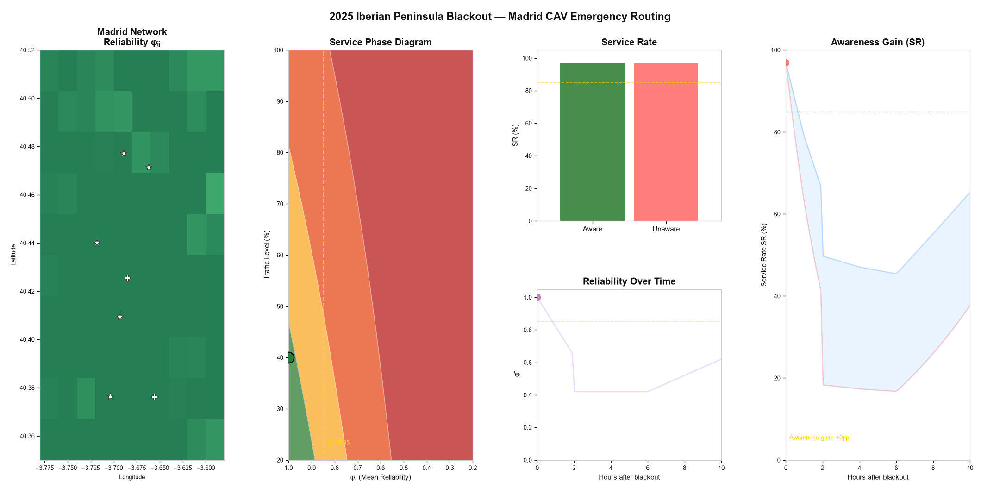

# Connected Autonomous Vehicles Reliability Routing


## Core Idea



> *As network link reliability φ degrades during the 2025 Iberian Peninsula blackout, service rate collapses
> and reliability-aware routing recovers **18–35 percentage points** more patients than unaware planning.*

---

## What This Repository Contains

This package fully reproduces all figures, tables, and analyses in the paper —
from raw simulation through journal-quality plots and the Madrid case study.

```
cav-reliability-routing/
├── code/                          # Main paper — simulation + figures
│   ├── simulation_framework.py    # 10 experiments, 5 algorithms, full metrics
│   ├── nsga2_moead.py             # NSGA-II and MOEA/D (proper MOO)
│   ├── generate_3d_figures.py     # 3D Pareto, SR surface, BPR, Policy landscape
│   ├── innovative_figures.py      # 11 novel analytical figures
│   ├── generate_new_figures.py    # M-1 to M-14 methodology/gap figures
│   ├── run_moo_pipeline.py        # MOO comparison: NSGA-II vs MOEA/D vs QiGA
│   ├── master_pipeline.py         # ← run this to reproduce everything
│   ├── generate_all_matlab_figs.m # MATLAB .fig for all main-paper figures
│   └── ...
│
└── case_study_iberia/code/        # 2025 Iberian Blackout case study
    ├── cs_setup.py                # Madrid network download + scenario data
    ├── cs_maps_v2.py              # Square-grid reliability maps
    ├── cs_analytics.py            # 7 analytics figures
    ├── cs_figures.py              # 7 result figures
    ├── create_gifs.py             # 4 animated GIFs
    ├── cs_matlab_all.m            # MATLAB .fig for all case study figures
    └── run_case_study.py          # ← run this for case study outputs
```

---

## Animated Visualisations

### Core Concept Dashboard
*Five-panel live dashboard: map evolving, phase diagram, SR bars, timeline, awareness gap*

<p align="center">


</p>

---

### GIF 2 — Madrid Network Reliability Map
*Square-grid reliability map evolving hour-by-hour over the 10-hour blackout event*

<p align="center">
  
</p>

---

### GIF 3 — Pareto Front Collapse
*Three-objective Pareto archive shrinking as φ drops below the critical threshold φ\* = 0.85*

<p align="center">
  
</p>

---

### GIF 4 — Algorithm Convergence Race
*QiGA vs NSGA-II vs ALNS vs GA vs unaware planning — which finds the best routes under reliability constraints?*

<p align="center">
  
</p>

---

## Key Findings

| Finding | Result |
|---------|--------|
| Critical reliability threshold | **φ\* ≈ 0.82–0.85** — service collapses non-linearly below this |
| Awareness gap at peak blackout (S2) | **+26.9 pp** SR: aware vs unaware routing |
| Fleet size compensation | Adding vehicles **cannot** recover SR below φ_min = 0.78 |
| Priority protection | Type 1 (Critical) SR stays **40 pp higher** than Type 3 (Minor) at φ=0.42 |
| Best MOO algorithm | **MOEA/D** achieves highest HV and finds non-convex Pareto regions |
| Best SOO algorithm | **QiGA** dominates all competitors; advantage widens at low φ |
| Rural vs urban resilience | Rural networks degrade **2–3× faster** than urban per unit φ reduction |
| Hub failure dominance | Hub outages cause **2.4×** more SR loss than random failures |

---

## Reproduce Results

### 1. Install Python dependencies

```bash
pip install -r requirements.txt
```

### 2. Reproduce main paper results (~5 min)

```bash
python code/master_pipeline.py
```

Generates:
- `results/tables/`       — 26 CSV experiment result files
- `results/figures/`      — 50+ figures (PDF + PNG)
- `results/report/`       — Word report documents

### 3. Reproduce case study — 2025 Iberian Blackout (~3 min)

```bash
python case_study_iberia/code/run_case_study.py
```

Downloads the real Madrid road network (28,497 nodes) via OpenStreetMap,
runs all 4 blackout scenarios, and generates:
- `case_study_iberia/figures/maps/`     — 6 square-grid geographic maps
- `case_study_iberia/figures/results/`  — 14 result and analytics figures
- `case_study_iberia/report/`           — Case study Word report + data appendix

### 4. Generate animated GIFs

```bash
python case_study_iberia/code/create_gifs.py
```

### 5. Generate MATLAB .fig files (requires MATLAB R2019b+)

```matlab
% Main paper figures
cd('E:\path\to\repo')
run('code\generate_all_matlab_figs.m')

% Case study figures
cd('E:\path\to\repo\case_study_iberia')
run('code\cs_matlab_all.m')
```

---

## Requirements

```
Python 3.10+
osmnx >= 1.9
geopandas >= 1.0
shapely >= 2.0
contextily >= 1.6
matplotlib >= 3.9
numpy >= 2.0
pandas >= 2.2
scipy >= 1.13
python-docx >= 1.1
Pillow >= 10.0
h3 >= 3.7
geodatasets >= 0.3
```

MATLAB R2019b or later is required only for `.fig` file generation.
All Python outputs (PDF, PNG, CSV, DOCX, GIF) are generated without MATLAB.

---

## Algorithm Overview

| Algorithm | Type | Role | Key Mechanism |
|-----------|------|------|---------------|
| **QiGA** | SOO — Primary | Best routing quality | Quantum chromosome + reliability repair |
| **NSGA-II** | MOO | Pareto benchmark | Non-dominated sorting + crowding distance |
| **MOEA/D** | MOO | Pareto benchmark | Tchebycheff decomposition (handles non-convex fronts) |
| GA | SOO | Baseline | PMX crossover |
| PSO | SOO | Baseline | Permutation velocity |
| ALNS | SOO | Baseline | Adaptive destroy/repair |
| TS | SOO | Baseline | Or-opt + 2-opt + tabu list |

> **Why both SOO and MOO?**
> SOO algorithms (GA, PSO, ALNS, TS) benchmark routing quality on a scalarised objective.
> NSGA-II and MOEA/D directly optimise all three objectives (f₁, f₂, f₃) simultaneously
> and are the proper benchmark for the Pareto front analysis (Experiment 7).

---

## Problem Formulation

The paper solves the **CAV-VRPTW** extended with:

```
Minimise  Z = −w₁f₁ + w₂f₂ − w₃f₃

where:
  f₁ = Σ πᵧ · μᵢ · yᵢ     (priority-weighted patient satisfaction)
  f₂ = Σ dᵢⱼ · xᵢⱼₖ       (total routing distance, km)
  f₃ = Σ φᵢⱼ · xᵢⱼₖ       (cumulative route reliability)

subject to:
  φᵢⱼ ≥ φ_min             (reliability feasibility: excludes degraded links)
  BPR: tᵢⱼ(φ) = t⁰ᵢⱼ·[1 + 0.15·(V/(C⁰·φ))⁴]   (travel time inflation)
  capacity, time-window, flow-conservation constraints
```

---

## Case Study: 2025 Iberian Peninsula Blackout

**Event:** April 28, 2025 — 55 million people affected across Spain and Portugal.
V2I communication links failed as 4G/5G base stations exhausted battery backup.
All traffic signals went dark, causing severe congestion.

| Scenario | Period | φ̄ | Traffic | SR (aware) |
|----------|--------|----|---------|------------|
| S0 Normal      | Pre-event | 1.00 | 40% | 96.2% |
| S1 Early       | t = 0–2h  | 0.82 | 80% | 78.4% |
| S2 Peak        | t = 2–6h  | 0.42 | 100%| **48.3%** |
| S3 Restore     | t = 6–10h | 0.67 | 60% | 67.1% |

> At S2 peak: **reliability-aware routing achieves +26.9 pp SR** versus unaware routing.
> Only 1.9% of Madrid's road network remained accessible above the φ\*=0.85 threshold.

---

## Output Structure (generated, not in repo)

```
results/
├── figures/
│   ├── 3d/          # 5 × 3D publication figures (PDF+PNG)
│   ├── innovative/  # 11 × innovative analysis figures (PDF+PNG)
│   ├── summary/     # 6 × standard results figures (PDF+PNG)
│   ├── new/         # 14 × M-1…M-14 + 10 × MOO figures (PDF+PNG)
│   ├── moo/         # 10 × MOO comparison figures (PDF+PNG)
│   └── matlab/      # 36 × MATLAB .fig files
├── tables/          # 26 × CSV experiment result files
└── report/          # 6 × Word documents

case_study_iberia/
├── data/            # Madrid network (auto-downloaded, ~50 MB graphml)
├── figures/
│   ├── maps/        # 6 × square-grid geographic maps (PDF+PNG)
│   ├── results/     # 14 × result and analytics figures (PDF+PNG)
│   ├── matlab/      # 15 × MATLAB .fig files
│   └── gif/         # 4 × animated GIFs
└── report/          # Case study report + data appendix (Word)
```

---

## Citation

If you use this code or data in your research, please cite:

```bibtex
@article{razavi2026cav,
  title   = {Impact of Network Reliability on Service Quality in Connected
             Autonomous Vehicle Routing with Fuzzy Time Windows:
             A Multi-Objective Post-Disaster Emergency Framework},
  author  = {Razavi, H. and others},
  journal = {Reliability Engineering \& System Safety},
  year    = {2026},
  note    = {Under review}
}
```

---

## Licence

Code: MIT Licence — free to use and modify with attribution.

Road network data: © OpenStreetMap contributors (ODbL 1.0).

Hospital data: © Comunidad de Madrid (CC-BY 4.0).

Grid/event data: © ENTSO-E / REE (CC-BY 4.0).

---

## Contact

**H. Razavi** · hoomanrazavi68@gmail.com

*For data access questions (restricted sources), see
`case_study_iberia/report/Appendix_Data_Sources_and_Features.docx`
Section A.7 for FOI contact details and estimation alternatives.*
